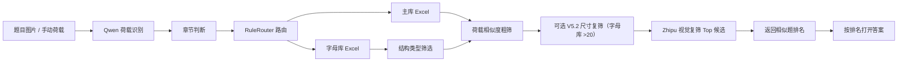

# 结构力学题库 AI 检索系统

这是一个面向结构力学答疑场景的本地题库检索系统。用户上传题目图片，或手动输入荷载信息后，系统会在结构力学题库中查找最相似的题目，并按排名打开对应答案。

项目重点不是简单的图片识别，而是把“题图识别、章节判断、荷载归一化、题库路由、相似度粗筛、视觉复筛、答案定位”串成一条可落地的工作流。

## 项目亮点

- 多入口使用：支持命令行、飞书机器人和隔离开发中的 Agent。
- 图片到检索链路：用 Qwen 识别题图中的荷载与可见题干信息，再进入本地题库检索。
- 适度放开的自动章节：先单独抄取图片中实际可见的题干；没有题干的纯结构图直接要求用户手动选择，有题干时再按明确方法文字、典型题型文字和结构信息识别章节，并全量记录章节判断样本用于后续优化。
- 主库 / 字母库分流：数值荷载题和未赋值字母荷载题分开维护，字母题通过编码归一化和结构类型筛选后复用相似度算法。
- 候选视觉复筛：粗筛后默认用智谱 `glm-4.6v` 只比较主杆件骨架和整体轮廓，忽略荷载位置、方向、尺寸和文字；默认最多 10 候选并发复筛，单项超时会单独补评，仍不完整时整体回退粗筛；最终相似度仍按“粗筛荷载分 + 视觉轮廓分”的混合分控制输出质量。
- 多题图处理：飞书端支持一张图片中包含多道题，先给出题号、章节、荷载摘要，再按用户选择逐题检索。
- 题库维护闭环：支持漏存审计、飞书新增题目入库、候选错题删除；写入 live Excel 前会备份。

## 适用场景

这个项目来自真实结构力学答疑工作流，主要解决三类问题：

1. 题库题目越来越多，手动按文件夹找答案很慢。
2. 同一类题目在结构形状、荷载位置、字母/数值表达上有很多变体，纯文件名或关键词检索不可靠。
3. 手机端收到题图后，希望快速返回相似题和答案，而不是先保存图片、打开电脑、手动搜索。

## 独立 Agent 本地 Demo

新的 Agent 有独立的本地网页入口，不复用现有飞书机器人的端口、配置或运行状态：

```powershell
python -B scripts/run_tiku_agent_demo.py --port 8790
```

打开 `http://127.0.0.1:8790` 后可发题图或直接文字对话。页面采用单会话聊天画布：顶部菜单可打开临时会话抽屉，桌面和移动端入口一致，不伪造尚未实现的多会话历史。上传、拖放、候选题卡片选择、答案查看和图片大图预览均在同一条消息内完成；顶部栏和底部组合输入区固定，只有中间消息区滚动。识别到章节、用户补充章节或确认全局搜索后，同一个临时气泡会按真实执行阶段更新搜索状态，完成后由正式结果替换。

会话、上传题图、候选图、裁图和答案输出默认位于 `.tmp_tiku_agent_v2/`，媒体地址与当前 Cookie 会话绑定。上传原图、候选图和答案图在刷新或 Demo 重启后仍可显示，最后一次检索或对话操作 2 小时后统一过期；网页进程会定时清理过期会话，媒体响应使用 `private, no-store` 避免浏览器继续缓存。“新对话”会停止前端等待，并在同一会话的在途任务结束后清理状态，避免旧任务重新写回。前端会在上传前检查图片类型和 15MB 大小限制，并把服务端异常转换为可理解的中文提示。该入口会记录不含用户原话、图片路径或模型原文的结构化任务日志。

Agent 现在只有 Intent V2，不再提供 V1 运行开关。线上 8790 由隐藏进程启动，并使用独立生产目录 `.tmp_tiku_agent_v2_prod_8790/`。8790 默认启用状态感知安全回答 V0：寒暄、致谢等普通安全对话会收到由当前业务阶段生成的脱敏摘要，模型可以自然组织语言，但不能执行操作、编造候选或答案；“支持哪些章节”这类必须准确的产品事实则从代码中的 `CHAPTERS` 生成不带教材章号的知识范围固定答案，其中矩阵位移和影响线明确限制为只支持含具体外荷载的题目；该固定事实由 8790、8793、8794 Agent 入口共同复用，不调用意图模型、回答模型或业务工具，也不修改会话状态；业务指令仍直接进入各自原状态机。8788 飞书保持纯搜题工作流，不接入寒暄或固定事实问答。模型回答还会经过状态一致性、执行声明、内部字段和业务状态未变化校验，不合格时按当前阶段使用固定兜底。业务工具使用 `SUCCESS / NO_MATCH / NEEDS_INPUT / PARTIAL / TOOL_ERROR` 五态结果，固定状态机据此决定继续、澄清、回退或失败。视觉复筛会校正带EXIF旋转标记的输入图，但不修改题库源文件；普通图片仍发送原始字节。

8790 的生产运行目录还会保存 `model_costs.sqlite3`。实际发给千问或智谱的调用会记录模型、调用类型、成功/失败、重试次数、耗时、输入/图像/缓存/输出 Token 和按版本化官网标准价估算的人民币费用；不保存用户原话、Prompt、图片或本地路径。并发复筛先在本轮内存中收集，回合结束后一次事务写入，不额外调用模型。一次题图任务跨补章节、继续搜索等回合时按脱敏会话键和题目版本汇总为同一个 `search_key`。8793和8794不接入该费用数据库；8788只以 SQLite 只读模式查询8790的汇总记录，不写入8790运行状态。

8790 是网页主线和后续邀请制内测入口；8793 暂时保留为当前稳定演示/回退快照，不随本轮公网保护改动刷新。8790 的看门狗默认只允许 1 个活动任务、2 个排队任务，排队最多等待 55 秒；同一会话的处理和“新对话”清理会串行执行。每日费用硬上限必须在开放公网前显式设置，未设置时只记录费用、不自动熔断：

```powershell
$DailyBudgetCny = 5.0  # 仅为命令格式示例，开放前由用户确定实际金额
python -B scripts/run_tiku_agent_demo.py --port 8790 `
  --runtime-dir .tmp_tiku_agent_v2_prod_8790 `
  --max-concurrent-tasks 1 --max-queued-tasks 2 --queue-wait-seconds 55 `
  --daily-budget-cny $DailyBudgetCny
```

本地开发默认仍保持不限制并发且不启用费用上限，避免改变测试和单人调试语义。邀请用户前还必须在 8790 外层配置独立 Cloudflare Tunnel 和 Access 白名单；不得复用 8788 飞书隧道，也不得直接做路由器端口映射。

### 独立管理后台（8795）

管理员后台是独立服务，不部署到 8790，也不复用用户的邀请码登录状态。第一版提供管理员登录、今日搜题量和估算费用、每个邀请码的用量与额度、邀请码新增/停用/重置/归档、反馈筛选、完整对话详情、反馈处理备注及全站设置。邀请码和反馈都支持归档、取消归档及受保护的永久删除；有费用或反馈历史的邀请码不能永久删除。反馈使用稳定的 `FB-日期-短码` 编号，章节筛选只列出反馈库中真实存在的非空章节，“全部章节”仍包含章节为空的记录；反馈详情保存从上传题图到候选可见的用户侧搜题耗时，无法可靠还原的旧反馈显示暂无数据。设置页最近操作默认显示 10 条，可展开查看接口返回的最近 30 条，审计记录不会因此删除。用户登录认证仍只使用邀请码哈希；8795 另用运行目录中的独立 AES-GCM 密钥加密保存新建或重置后的邀请码，列表只显示脱敏值，管理员点击复制时才解密并写入审计。旧哈希邀请码无法还原，重置后才具备此能力。反馈案例默认保留 30 天，包含用户当时可见的对话和题目/结果图片，不保存隐藏 Prompt、模型内部推理、密钥或本地路径。

先在本机运行和验收，确认后再创建 `admin.<你的域名>` 子域名并把它反向代理到 8795；公网入口必须额外启用 Cloudflare Access。无需提前购买或创建新域名，也不要把 8795 直接暴露到公网：

```powershell
python -B scripts/run_tiku_admin.py --port 8795 `
  --admin-runtime .tmp_tiku_admin_8795 `
  --source-runtime .tmp_tiku_agent_v2_prod_8790
```

首次只在服务所在电脑打开 `http://127.0.0.1:8795/setup` 设置独立管理员密码。需要长期本地运行时可使用 `scripts/tiku_admin_watchdog_8795.ps1`；控制库、邀请码加密密钥和后台日志位于 `.tmp_tiku_admin_8795/`，不得提交。备份或迁移后台时必须把 `control.sqlite3` 与 `invite_code_encryption.key` 一起保护和迁移，丢失密钥后已加密的邀请码无法复制，只能重置。

正式 8790 已接入后台控制库，后台中的邀请码状态和额度修改会作用于后续请求。迁移或灾备重建时，应先预检原哈希配置与控制库是否存在 ID/哈希冲突；默认命令只输出计数和冲突、不写数据库。确认后显式添加 `--apply-import`，它会保留后台已经创建的邀请码，只补入缺失的旧邀请码，并迁移旧 Cookie 签名密钥。导入可重复执行，不会重复创建记录，也不会覆盖后台已经修改的状态：

```powershell
python -B scripts/manage_tiku_admin.py `
  --control-db .tmp_tiku_admin_8795/control.sqlite3 `
  --import-invites <原哈希邀请码配置路径>

python -B scripts/manage_tiku_admin.py `
  --control-db .tmp_tiku_admin_8795/control.sqlite3 `
  --import-invites <原哈希邀请码配置路径> `
  --apply-import
```

导入完成后，再选择维护窗口让 8790 改用同一个控制库；这是认证与额度数据源的受控迁移，不是把后台部署进 8790：

```powershell
python -B scripts/run_tiku_agent_demo.py --port 8790 `
  --runtime-dir .tmp_tiku_agent_v2_prod_8790 `
  --max-concurrent-tasks 1 --max-queued-tasks 2 --queue-wait-seconds 55 `
  --control-db .tmp_tiku_admin_8795/control.sqlite3
```

切换到控制库后，8790 会在每次请求前重新读取邀请码状态和全站/单码额度；导入时保留的旧 Cookie 可继续使用，之后停用或重置邀请码会使对应旧登录状态失效。不要同时传入旧的 `--invite-config` 或静态费用上限参数。

正式切换使用专用脚本。默认调用只做健康、路径、ID/哈希/状态/认证版本一致性和当前看门狗唯一性预检，不会停止进程；维护窗口确认后才添加 `-Apply`。严格检查用于防止后台测试过的邀请码状态或认证版本意外覆盖旧线上状态、使旧 Cookie 失效。脚本会再次备份、精确停止已验证的看门狗与 8790 子进程、启动控制库模式并验证临时邀请码登录和动态停用；任一步失败都会恢复旧哈希配置模式：

```powershell
powershell -ExecutionPolicy Bypass -File scripts/switch_tiku_agent_8790_control.ps1

powershell -ExecutionPolicy Bypass -File scripts/switch_tiku_agent_8790_control.ps1 `
  -Apply
```

查看8790最近7天费用：

```powershell
python -B scripts/model_cost_report.py --runtime-dir .tmp_tiku_agent_v2_prod_8790 --days 7
```

可增加 `--daily-budget 1.0` 查看每日预算50%/80%/100%告警，或用 `--run-id <id>` 查询一次运行的逐调用明细。正常调用只静默记录；超过10次模型调用、Token缺失、价格缺失或模型失败会写入结构化告警码。累计至少50次搜题后，报表还会用搜题费用P95的2倍标记成本异常。价格快照位于 `tiku_shared/model_price_catalog.json`，历史记录保留当时的 `price_version`；临时折扣、赠送额度和资源包不计入标准估算，实际账单仍应按月与供应商控制台核对。

如需临时回退到原固定对话回复，可在手动启动 8790 时显式关闭安全回答：

```powershell
python -B scripts/run_tiku_agent_demo.py --port 8790 --disable-safe-answer-v0
```

下一阶段“自主做事”开发继续使用独立 worktree、分支和 8794 入口，并隔离源码、端口、Cookie 和全部可写运行状态：

```powershell
python -B scripts/run_tiku_agent_8794.py
```

默认访问 `http://127.0.0.1:8794`，会话数据库、上传/媒体文件、临时 incoming 文件和任务日志统一位于 `.tmp_tiku_agent_v2_candidate_8794/`。8794 使用独立 Cookie `tiku_agent_8794_session`，不会与同一浏览器中的 8790 会话标识混用。状态感知安全回答、五态工具结果与视觉方向校准已经验收并提升到8790；8794继续承载下一阶段只记录、不执行的影子规划，当前仍不包含自主规划执行或LangGraph。

需要临时回退原固定对话回复时，可显式关闭安全回答：

```powershell
python -B scripts/run_tiku_agent_8794.py --disable-safe-answer-v0
```

Intent V2 还提供受限的全局搜索兜底：只有章节判断失败、Agent 已明确提供该选项且用户明确同意时才会执行。它跨第 2–8 章收集粗筛分数 `>= 0.999` 的内容去重候选；字母库会先按已识别结构类型过滤，去重后候选严格超过 20 条时再走同一套 V5.2 尺寸复筛，然后以最多 10 路并发完成剩余视觉复筛。复筛后按与普通章节一致的加权方式计算最终分（粗筛荷载分 50% + 视觉复筛分 50%），只展示最终分 `>= 0.95` 的结果并标注来源章节。结果仍是候选，必须由用户选择 `candidate_rank` 后才会读取答案。普通章节检索和现有飞书机器人不走该流程。

普通章节检索的候选阶段支持结果反馈：用户可以说“没有”“都不是”否定当前批次，说“继续搜”“换一批”查找下一批未尝试候选；答案返回后既可以改选同一批次的其他候选，也可以说“答案不对”或“回到候选”。上传新题或生成新候选批次后，旧候选按钮仍会失效。`continue_search` 会沿用当前题图、章节和题库路由，排除已经进入过粗筛批次的候选；没有剩余候选时只提示换章节或补充更清楚的题图，不会把错误恢复专用的 `retry_search` 当作继续检索，也不会自动放宽章节或全局搜索边界。

## 实验分支

[`experiments/decision_trace_lab`](experiments/decision_trace_lab) 用于在不影响展示主线的前提下，记录并人工复核真实 Agent 的中间决策，帮助定位意图、工具和状态流转问题。分支目的、运行方式和隔离边界见[实验 README](experiments/decision_trace_lab/README.md)。

## 系统流程



## 目录说明

```text
.
├── search.py                      # 基础检索、储存、答案定位
├── multi_agent_pipeline.py        # Qwen 识别、路由、复筛协调
├── scripts/
│   ├── multi_agent_search.py      # 多 Agent CLI 检索
│   ├── search_by_loads.py         # 荷载检索 / 答案 CLI
│   ├── feishu_tiku_bot.py         # 飞书机器人
│   ├── feishu_store_flow.py       # 飞书新增题目入库
│   ├── feishu_delete_flow.py      # 飞书候选错题删除
│   ├── chapter_judgment_log.py    # 飞书章节判断 JSONL 日志
│   ├── audit_unindexed_questions.py
│   ├── store_unindexed_questions.py
│   └── smoke_test.py              # 只读验证
├── experiments/
│   └── decision_trace_lab/         # 隔离的主线轨迹记录与人工复核实验
├── config.example.json            # 配置模板
└── requirements.txt
```

## 题库结构

当前按 7 个章节维护：

- `2静定结构`
- `3静定结构位移`
- `4力法`
- `5位移法`
- `6力矩分配`
- `7矩阵位移`
- `8影响线`

主库保存数值荷载题和已赋值字母题，例如 `P=40kN`、`q=20kN/m`。

字母库保存未赋值字母题，例如 `q`、`2P/a`、`M`。字母库 Excel 核心列为 `题目名称`、`荷载`、`结构类型`、`长×宽`、`单边尺寸`。这类题会写入相似度编码，同时保留原始字母标注，避免把不同量纲体系混在一起比较。

字母库检索会先按章节定位，再按 `梁`、`钢架`、`桁架`、`拱` 做结构类型筛选，最后按荷载相似度排序。结构类型优先从题干文字推断；题干不明确时才调用图像分类模型。飞书新增字母题时必须同步写入 `结构类型`，否则后续检索可能漏掉新题。

字母库 Excel 另有 `长×宽` 和 `单边尺寸` 两列。8790、8788、8793、8794 和多 Agent CLI 默认启用尺寸复筛；指定章节检索或经用户授权的跨章节全局搜索，都只在已知结构类型、字母库荷载粗筛的 100% 内容去重候选严格超过 20 条时，额外调用一次 Qwen V5.2 识别查询图尺寸。完整两轴尺寸不同才允许剔除；任一边只有单边尺寸时只做同值优先排序，不同值和缺失值都保留。拱不参与；梁的完整尺寸必须为“长×0”。各命令行入口可用 `--disable-dimension-filter` 临时回退。

> 说明：题库图片、答案图片和真实配置属于本地资产，不随仓库公开。克隆仓库后需要在 `config.local.json` 中配置自己的题库路径和模型密钥。

## 快速开始

安装依赖：

```powershell
pip install -r requirements.txt
```

复制配置：

```powershell
copy config.example.json config.local.json
```

在 `config.local.json` 中填写：

```json
{
  "root": "D:\\path\\to\\question-bank",
  "answer_output": "D:\\path\\to\\answer-output",
  "dashscope_api_key": "",
  "zhipuai_api_key": "",
  "zhipu_rerank_model": "glm-4.6v",
  "dimension_filter_enabled": true,
  "top_k": 3
}
```

图片检索：

```powershell
python scripts/multi_agent_search.py --image "D:\path\to\question.jpg" --chapter auto
```

多 Agent CLI 默认开启尺寸复筛；如需临时回退：

```powershell
python scripts/multi_agent_search.py --image "D:\path\to\question.jpg" --chapter auto --disable-dimension-filter
```

手动荷载检索：

```powershell
python scripts/search_by_loads.py loads-search --types "均布" --raws "20" --chapter "2静定结构"
```

获取上一次检索的第 1 个答案：

```powershell
python scripts/search_by_loads.py answer 1
```

### 恢复的桌面 GUI

历史桌面端已作为独立兼容入口恢复，不替代 8790 网页 Agent，也不影响 8788 飞书服务：

```powershell
python legacy_gui.py
```

桌面端支持图片或手动荷载检索、候选预览、答案打开与复制。单题入库会先生成主库/字母库路由计划，用户确认后才备份并写入；备份保存到仓库外的 `F:\cc\_backups\7-题库检索\<日期>`。漏存审查按钮仅生成只读计划和报告，不直接批量写入 live 题库。`tkinterdnd2` 用于拖放图片；缺少它时仍可通过文件选择器使用 GUI。

## 飞书机器人

启动本地服务和临时公网隧道：

```powershell
.\启动结构力学题库.bat
```

飞书端支持：

- 发题图后自动处理并回复候选题。
- 回复实际显示的序号获取对应答案。
- 回复 `0` 结束当前检索。
- 回复 `a` 切换自动章节 / 手动章节模式。
- 多题图先返回题号和识别摘要，用户再按题号逐题检索。
- 回复 `+` 进入新增题目入库流程。
- 在候选页回复对应负数可删除错误候选，删除前会二次确认并备份。
- 管理员单独回复半角 `?` 或全角 `？`，可查看自上次成功查询截止以来有费用更新的搜题数、严格超过0.05元的数量、最高单次完整费用和汇总费用；首次查询覆盖最近24小时。该入口默认关闭，需在 `config.local.json` 配置 `feishu_admin_sender_ids`，或由本机维护者在专用私聊首次绑定。首次绑定时，以 `scripts/start_tiku_bot.ps1 -EnrollAdminSenderOnce` 启动8788，随后从该私聊发送任意一条普通消息；机器人只将身份标识保存到其本机 `.tmp_feishu_tiku` 状态目录，绝不在飞书回复或日志中展示。绑定成功后必须正常重启8788，普通问句不会触发费用查询。

飞书端每次章节判断都会写入 `data/feishu_chapter_failure_log.jsonl`，包括自动采用、需要手动和手动补章节样本。这个文件名沿用早期失败日志名，但现在用于全量观察章节判断效果。

## 漏存审计与补库

只扫描未入库题图，不写 Excel：

```powershell
python scripts/audit_unindexed_questions.py
```

预演自动补库：

```powershell
python scripts/store_unindexed_questions.py
```

确认后写入 Excel：

```powershell
python scripts/store_unindexed_questions.py --apply
```

写入前会备份被修改的 Excel 到 `backups/`。`special_unindexed_questions.json` 用于记录确认不参与题库检索的特殊题，审计时会自动排除。

## 验证

提交前建议运行：

```powershell
python scripts/smoke_test.py
```

它会只读检查题库 Excel、荷载 JSON、图片路径、路径修复逻辑、多 Agent 路由和飞书基础状态机。

## 技术取舍

- 不跨章节盲搜：结构力学不同章节的相似图形可能解法完全不同，因此纯结构图不自动猜章节；有明确方法词或典型题型文字时才自动采用。Intent V2 仅在章节未知并经用户明确授权后提供严格全局搜索兜底，不自动触发，也不降低阈值返回猜测。
- 粗筛和复筛分层：先用荷载相似度保证速度；粗筛有 100% 匹配时只保留全部 100% 结果，没有 100% 匹配时只保留最相似的 1 个，再对保留候选做视觉复筛。
- 复筛结果不硬补 Top 3：最终相似度 `>=90%` 的候选全部输出；没有候选达到 90% 时，若最高分 `>=80%` 则只输出最高的 1 个；最高分低于 80% 时返回“未找到可靠相似题”，不展示低可信候选。初筛候选池和复筛失败时的粗筛回退仍按原逻辑保留。
- 主库和字母库分离：未赋值字母题如果直接和数值题混搜，容易出现量纲混淆，所以单独路由。
- 自动补库保守写入：只有能明确路由到主库或字母库的题才自动追加，异常和混合情况进入报告等待人工复核。

## 安全说明

- 不要提交 `config.json`、`config.local.json`、`.env` 或真实 API key。
- 本地工具配置如 `.claude/settings.local.json` 不应提交。
- 飞书密钥建议使用环境变量配置。
