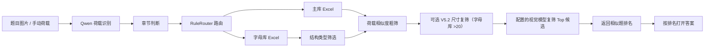

# 结构力学题库 AI 检索系统

这是一个面向结构力学答疑场景的本地题库检索系统。用户上传题目图片，或手动输入荷载信息后，系统会在结构力学题库中查找最相似的题目，并按排名打开对应答案。

项目重点不是简单的图片识别，而是把“题图识别、章节判断、荷载归一化、题库路由、相似度粗筛、视觉复筛、答案定位”串成一条可落地的工作流。

> C 端复杂题图 A1/A2/A3 的完整开发规范见 [`docs/8890_complex_image_agent_plan.md`](docs/8890_complex_image_agent_plan.md)。A3-V1 已提升到 8790 生产网页主线：A1 停止，A2 直接进入原检索，A3 执行“整页结构化理解 -> GLM 整页裁图 -> 多题全部并发 Qwen 校验与外荷载门禁并自动打开选题继续页/单题自动下行 -> A2”，失败回退人工裁剪。`8896` 保留同逻辑隔离验收，`8897` 暂作校验前多选回退/对照；`8892` 只保留 Paddle V2 离线试验。

## 项目亮点

- 多入口使用：支持命令行、飞书机器人和隔离开发中的 Agent。
- 图片到检索链路：用 Qwen 识别题图中的荷载与可见题干信息，再进入本地题库检索。
- 适度放开的自动章节：先单独抄取图片中实际可见的题干；没有题干的纯结构图直接要求用户手动选择，有题干时再按明确方法文字、典型题型文字和结构信息识别章节，并全量记录章节判断样本用于后续优化。
- 主库 / 字母库分流：数值荷载题和未赋值字母荷载题分开维护，字母题通过编码归一化和结构类型筛选后复用相似度算法。
- 候选视觉复筛：由 `rerank_provider` 配置为 Zhipu `glm-4.6v` 或 DashScope Qwen `qwen3.7-plus`；首轮 10 并发对照中 Qwen + 当前 V1 Prompt 的 Top-1 命中率和同类召回明显优于其他组合，因此 8790 A3-V1 子 A2 与 8896 使用该组合。8788 与参数式 CLI 仍保持共享 Zhipu 默认策略。最新 V4 Prompt 暂不切换，因为在固定样本上把同类候选普遍压低。复筛候选池最多 3 个（满分候选可全部保留），超时或失败仍整体回退粗筛。
- 多题图处理：飞书端支持一张图片中包含多道题，先给出题号、章节、荷载摘要，再按用户选择逐题检索。
- 题库维护闭环：支持漏存审计、飞书新增题目入库、候选错题删除；写入 live Excel 前会备份。

## 适用场景

这个项目来自真实结构力学答疑工作流，主要解决三类问题：

1. 题库题目越来越多，手动按文件夹找答案很慢。
2. 同一类题目在结构形状、荷载位置、字母/数值表达上有很多变体，纯文件名或关键词检索不可靠。
3. 手机端收到题图后，希望快速返回相似题和答案，而不是先保存图片、打开电脑、手动搜索。

## 独立 Agent 本地 Demo

新的 Agent 有独立的本地网页入口，不复用现有飞书机器人的端口、配置或运行状态：

```powershell
python -B scripts/run_tiku_agent_8790.py --port 8790 `
  --runtime-dir .tmp_tiku_agent_v2_prod_8790 `
  --control-db .tmp_tiku_admin_8795/control.sqlite3
```

打开 `http://127.0.0.1:8790` 后可发题图或直接文字对话。页面采用单会话聊天画布：顶部菜单可打开临时会话抽屉，桌面和移动端入口一致，不伪造尚未实现的多会话历史。上传、拖放、候选题卡片选择、答案查看和图片大图预览均在同一条消息内完成；顶部栏和底部组合输入区固定，只有中间消息区滚动。识别到章节、用户补充章节或确认全局搜索后，同一个临时气泡会按真实执行阶段更新搜索状态，完成后由正式结果替换。

会话、上传题图、候选图、裁图和答案输出默认位于 `.tmp_tiku_agent_v2/`，媒体地址与当前 Cookie 会话绑定。上传原图、候选图和答案图在刷新或 Demo 重启后仍可显示，最后一次检索或对话操作 2 小时后统一过期；网页进程会定时清理过期会话，媒体响应使用 `private, no-store` 避免浏览器继续缓存。“新对话”会停止前端等待，并在同一会话的在途任务结束后清理状态，避免旧任务重新写回。前端会在上传前检查图片类型和 15MB 大小限制；手机大图会优先缩至最长边 2560px，并用 JPEG 自适应压缩到约 1MB，必要时再缩至 2048px，避免多 MB 原图在移动网络下上传超时。Qwen 与智谱的共享模型输入层还会对绕过网页上传的飞书、CLI 和 Agent 大图执行同一上限策略；已压缩的小图直接保留原字节，源文件和题库原图不改写。当前运行中的 8788、8790 和 8794 已加载该共享层；8793 按要求继续使用原稳定快照，未同步本次改动。服务端异常会转换为可理解的中文提示。该入口会记录不含用户原话、图片路径或模型原文的结构化任务日志。

线上 8790 由隐藏看门狗启动，并使用独立生产目录 `.tmp_tiku_agent_v2_prod_8790/`。当前业务内核是 A3-V1：Qwen 权威 A1/A2/A3 分流，A3 使用 Qwen 整页理解、GLM 有界整页裁图；多题页默认把全部裁图并发提交 Qwen 完整性校验与独立外荷载门禁，全部完成后自动打开选题继续页，单题页直接下行，之后进入使用 Qwen 视觉复筛的子 A2。`--disable-auto-crop` 可把 A3 原位回退到 V0 人工裁剪。8788 飞书和参数式 CLI 不随本次提升改变。

8790 的生产运行目录还会保存 `model_costs.sqlite3`。实际发给千问或智谱的调用会记录模型、调用类型、成功/失败、重试次数、耗时、输入/图像/缓存/输出 Token 和按版本化官网标准价估算的人民币费用；不保存用户原话、Prompt、图片或本地路径。并发复筛先在本轮内存中收集，回合结束后一次事务写入，不额外调用模型。一次题图任务跨补章节、继续搜索等回合时按脱敏会话键和题目版本汇总为同一个 `search_key`。8793和8794不接入该费用数据库；8788只以 SQLite 只读模式查询8790的汇总记录，不写入8790运行状态。

8790 是网页主线和后续邀请制内测入口；8793 暂时保留为旧稳定演示/回退快照，8896 保留为同内核隔离验收线。本轮生产提升优先保留 8795 控制库中的邀请码认证；旧 8790 的并发队列、动态费用额度、完整费用汇总和反馈后台兼容暂不作为上线门禁，后续单独恢复：

```powershell
python -B scripts/run_tiku_agent_8790.py --port 8790 `
  --runtime-dir .tmp_tiku_agent_v2_prod_8790 `
  --control-db .tmp_tiku_admin_8795/control.sqlite3
```

本地开发默认仍保持不限制并发且不启用费用上限，避免改变测试和单人调试语义。邀请用户前还必须在 8790 外层配置独立 Cloudflare Tunnel 和 Access 白名单；不得复用 8788 飞书隧道，也不得直接做路由器端口映射。

### 独立管理后台（8795）

管理员后台是独立服务，不部署到 8790，也不复用用户的邀请码登录状态。第一版提供管理员登录、今日搜题量和估算费用、每个邀请码的用量与额度、邀请码新增/停用/重置/归档、反馈筛选、完整对话详情、反馈处理备注及全站设置。邀请码和反馈都支持归档、取消归档及受保护的永久删除；有费用或反馈历史的邀请码不能永久删除。反馈使用稳定的 `FB-日期-短码` 编号并按提交时间倒序显示，每页最多 50 条，超过 50 条才显示翻页按钮；归档反馈只提供取消归档和永久删除，取消归档后才能重新查看详情。章节筛选只列出反馈库中真实存在的非空章节，“全部章节”仍包含章节为空的记录；反馈详情保存从上传题图到候选可见的用户侧搜题耗时，无法可靠还原的旧反馈显示暂无数据。设置页最近操作每页显示 10 条并支持翻页，审计记录永久保留。用户登录认证仍只使用邀请码哈希；8795 另用运行目录中的独立 AES-GCM 密钥加密保存新建或重置后的邀请码，列表只显示脱敏值，管理员点击复制时才解密并写入审计。旧哈希邀请码无法还原，重置后才具备此能力。反馈案例默认保留 30 天，包含用户当时可见的对话和题目/结果图片，不保存隐藏 Prompt、模型内部推理、密钥或本地路径。

先在本机运行和验收，确认后再创建 `admin.<你的域名>` 子域名并把它反向代理到 8795；公网入口必须额外启用 Cloudflare Access。无需提前购买或创建新域名，也不要把 8795 直接暴露到公网：

```powershell
python -B scripts/run_tiku_admin.py --port 8795 `
  --admin-runtime .tmp_tiku_admin_8795 `
  --source-runtime .tmp_tiku_agent_v2_prod_8790
```

首次只在服务所在电脑打开 `http://127.0.0.1:8795/setup` 设置独立管理员密码。需要长期本地运行时可使用 `scripts/tiku_admin_watchdog_8795.ps1`；控制库、邀请码加密密钥和后台日志位于 `.tmp_tiku_admin_8795/`，不得提交。备份或迁移后台时必须把 `control.sqlite3` 与 `invite_code_encryption.key` 一起保护和迁移，丢失密钥后已加密的邀请码无法复制，只能重置。

正式 8790 已接入后台控制库，后台中的邀请码状态和额度修改会作用于后续请求。迁移或灾备重建时，应先预检原哈希配置与控制库是否存在 ID/哈希冲突；默认命令只输出计数和冲突、不写数据库。确认后显式添加 `--apply-import`，它会保留后台已经创建的邀请码，只补入缺失的旧邀请码，并迁移旧 Cookie 签名密钥。导入可重复执行，不会重复创建记录，也不会覆盖后台已经修改的状态：

```powershell
python -B scripts/manage_tiku_admin.py `
  --control-db .tmp_tiku_admin_8795/control.sqlite3 `
  --import-invites <原哈希邀请码配置路径>

python -B scripts/manage_tiku_admin.py `
  --control-db .tmp_tiku_admin_8795/control.sqlite3 `
  --import-invites <原哈希邀请码配置路径> `
  --apply-import
```

导入完成后，再选择维护窗口让 8790 改用同一个控制库；这是认证与额度数据源的受控迁移，不是把后台部署进 8790：

```powershell
python -B scripts/run_tiku_agent_8790.py --port 8790 `
  --runtime-dir .tmp_tiku_agent_v2_prod_8790 `
  --control-db .tmp_tiku_admin_8795/control.sqlite3
```

切换到控制库后，8790 会在每次请求前重新读取邀请码状态；导入时保留的旧 Cookie 可继续使用，之后停用或重置邀请码会使对应旧登录状态失效。本轮 A3-V1 提升暂不执行控制库中的全站/单码费用额度。

正式切换使用专用脚本。默认调用只做健康、路径、ID/哈希/状态/认证版本一致性和当前看门狗唯一性预检，不会停止进程；维护窗口确认后才添加 `-Apply`。严格检查用于防止后台测试过的邀请码状态或认证版本意外覆盖旧线上状态、使旧 Cookie 失效。脚本会再次备份、精确停止已验证的看门狗与 8790 子进程、启动控制库模式并验证临时邀请码登录和动态停用；任一步失败都会恢复旧哈希配置模式：

```powershell
powershell -ExecutionPolicy Bypass -File scripts/switch_tiku_agent_8790_control.ps1

powershell -ExecutionPolicy Bypass -File scripts/switch_tiku_agent_8790_control.ps1 `
  -Apply
```

查看8790最近7天费用：

```powershell
python -B scripts/model_cost_report.py --runtime-dir .tmp_tiku_agent_v2_prod_8790 --days 7
```

可增加 `--daily-budget 1.0` 查看每日预算50%/80%/100%告警，或用 `--run-id <id>` 查询一次运行的逐调用明细。正常调用只静默记录；超过10次模型调用、Token缺失、价格缺失或模型失败会写入结构化告警码。累计至少50次搜题后，报表还会用搜题费用P95的2倍标记成本异常。价格快照位于 `tiku_shared/model_price_catalog.json`，历史记录保留当时的 `price_version`；临时折扣、赠送额度和资源包不计入标准估算，实际账单仍应按月与供应商控制台核对。

如需临时回退 A3 自动裁图，可保留新分流和人工裁剪流程并显式关闭自动裁图：

```powershell
python -B scripts/run_tiku_agent_8790.py --port 8790 `
  --runtime-dir .tmp_tiku_agent_v2_prod_8790 `
  --control-db .tmp_tiku_admin_8795/control.sqlite3 `
  --disable-auto-crop
```

8890 已完成 Stage 0 隔离基线，并进入 Stage 2 预检影子观察；千问预检只在后台记录建议路线、摘要、自由观察、分流原因、耗时、令牌用量和错误，不改变现有固定检索返回，也不包含 Planner、LangGraph 或 DeepSeek Harness：

```powershell
python -B scripts/run_tiku_agent_8890.py
```

默认访问 `http://127.0.0.1:8890`。session 数据库、上传/媒体文件、incoming 临时图片、任务日志、费用、反馈状态和影子记录统一位于 `.tmp_tiku_agent_v2_validation_8890/`；影子记录文件是 `triage_shadow.jsonl`，临时副本完成观察后立即删除。独立 Cookie 为 `tiku_agent_8890_session`。原型默认不接入 8795 身份、邀请码或生产额度，不应绑定公网 Tunnel。回退时可添加 `--disable-image-triage-shadow`，不需要修改或重启其他端口。

8891 是权威分流 MVP：A1/A3 把上游观察和线路边界交给第二次千问生成用户说明，A2 跳过旧多题判断并进入现有精确识别和检索；旧并行外荷载检查在该入口关闭：

```powershell
python -B scripts/run_tiku_agent_8891.py
```

默认访问 `http://127.0.0.1:8891`，独立 Cookie 为 `tiku_agent_8891_session`，运行数据位于 `.tmp_tiku_agent_v2_validation_8891/`。`8890` 继续保持影子线路，`8790` 不受影响；本入口暂不处理 A3 自动拆解，也不接入正式身份或公网流量。

8892 当前是 A3 Phase 2 离线拆解入口，只做 OpenCV 候选块、题目分组、图角色判断、独立题目组章节提示、裁剪和校验，不调用 A2，也不监听 HTTP 端口。拆题 Prompt 不判断章节；章节识别共享现有章节规则，同一公共题干组只调用一次，不同题目组最多两路并发。默认运行数据位于 `.tmp_tiku_agent_a3_8892/`：

```powershell
python -B scripts/run_tiku_agent_8892.py --image "D:\path\to\complex-question.jpg"
```

8896 与 8891、现有飞书服务完全隔离，但复用 8891 的权威 A1/A2/A3 预检。A1 停止并说明原因；A2 带“已确认单题”标记直接进入原精确识别与检索。A3 先由 Qwen 建立公共题干、题目单元和结构图绑定，再把 Qwen 的完整唯一 `unit_id` 集合交给 GLM 一次定位整页裁图；GLM 标签只用于审阅，裁图绑定以 `unit_id` 为准。8790 与 8896 的多题页默认把全部裁图并发提交 Qwen 校验，全部完成后直接打开现有选题继续页；单题页仍自动校验并直接下行。8897 暂时保留校验前多选作为回退对照。Qwen 完整性校验与独立外荷载门禁通过后进入 A2，失败、无框或异常回到原人工裁剪，已有 GLM 框可作为预填建议。整页零自动通过时直接使用 V0 选题，不增加无意义的批量预校验；已有 bbox 仍保留裁图和整页框选。候选和答案显示原题标签；A2 进行中可通过“换题重新搜”切换原图题目，已检索题目会关闭，不能重复进入。该流程不调用 Paddle：

```powershell
python -B scripts/run_tiku_agent_8896.py
```

默认访问 `http://127.0.0.1:8896`，独立 Cookie 为 `tiku_agent_8896_session`，分流、A3/A2 会话、裁剪图、模型费用和反馈数据都位于 `.tmp_tiku_agent_a3_mvp_8896/`。上传新题或切换子题只重置当前检索状态，已经显示的题图、裁剪图、候选和答案继续保留到会话过期；新建对话或最后一次操作 2 小时后才统一清理。8896 与 8790 的 A2 和 A3→A2 入口共用严格章节三态及 Qwen 视觉复筛策略；8788 与参数式 CLI 默认策略不变。`--disable-auto-crop` 可原位回退到 V0 人工裁剪，`--disable-triage` 只用于本地诊断固定 A3 路径。

8897 目前是分流边界影子验证线，独立使用 `.tmp_tiku_agent_a3_v1_8897/` 和 `tiku_agent_8897_session`，默认策略为 V3。V1/V2/V3 的 Prompt、代码门禁和 17 张标注集结果保存在 `experiments/complex_image_eval/`；可通过 watchdog 的 `-TriagePolicyVersion v1|v2|v3` 选择版本。V3 的验收重点是阻止多题/相邻题残片直接进入 A2；截断图进入 A3 可以接受。该线不改变 8790、8896 或 8788。

8790 现使用 `scripts/run_tiku_agent_8790.py` 将上述 A1/A2/A3、A3-V1 自动裁图与多题自动全部校验提升为生产业务内核，并继续通过 `.tmp_tiku_admin_8795/control.sqlite3` 使用原邀请码认证。GLM 原始框会保留为 `model_bbox`；实际裁图在四边各增加原框尺寸的 5%，单边限制为整页归一化坐标的 1%～3%，减少支座、荷载和杆件贴边导致的误判。运行数据仍保存在 `.tmp_tiku_agent_v2_prod_8790/`；旧 `session.db` 不复用为 A3 会话库，新流程使用独立的 `a3_sessions.sqlite3` 与 `a3_sessions/`。本轮暂不保证 8795 对 A3 子 A2 费用和新反馈的完整汇总。

长期本地运行使用 `scripts/tiku_agent_watchdog_8790.ps1`：它只管理 8790 和 `.tmp_tiku_agent_v2_prod_8790/`，每 20 秒检查一次 `/health`，失败时重启 8790，不复用 8896 的运行状态。本机计划任务应独立于 `Tiku Agent A3 8896`；日志和 PID 位于 8790 运行目录根目录。

为逐步验收拆图，先使用独立版面区域识别入口。它只让千问识别独立大题、共享题干子题和每个图的粗略百分比区域，保存原始回答、规范化 JSON 和画框预览；不运行 OpenCV，不判断章节、荷载或图角色，也不调用 A2。默认运行数据位于 `.tmp_tiku_agent_a3_region_map_8892/`：

```powershell
python -B scripts/map_a3_regions.py --image "D:\path\to\complex-question.jpg"
```

可用 `--observation-json` 离线重放已保存区域 JSON。一个区域同时覆盖多个局部题号、区域明显重叠或存在未知绑定时，结果为 `uncertain`，不能进入后续裁剪；模型误用源图像素坐标时，运行时会在确认坐标未越界后换算为百分比。授权的 3 张代表图已通过粗分区验收：完整题图可以相互分开，粗框稍大或多出边缘残图候选由下一阶段的区域内 OpenCV 和裁剪校验处理。未经图片所有者授权，不要调用外部模型评测用户原图。

区域内 OpenCV 精裁实验使用已保存的区域 JSON，不调用模型或 A2。它联合区域内所有有效前景分量，避免只取最大连通块时丢失断开的荷载箭头、尺寸线和标注，并用相邻粗框限制外扩范围：

```powershell
python -B scripts/crop_a3_regions.py --image "D:\path\to\complex-question.jpg" --observation-json "D:\path\to\region_map.json" --output-dir ".tmp_tiku_agent_a3_region_crop_8892\trial"
```

输出包含逐区域裁图、`crop_manifest.json` 和蓝色粗框/红色 OpenCV 框对照图。当前真实图实验能保留荷载、尺寸和支座，但公共题干密集排布及跨区手写标记仍可能把相邻标签带入裁图；该入口只用于离线验收，尚不能把结果标为 `single_ready` 或交给 A2。

Paddle 候选框也有独立的离线质检入口。它读取已经保存的 PP-Structure 布局 JSON，给 `image` 框固定候选 ID，标记近重复框、整组大框、单容器框和贴页边框，并导出真实裁片、叠框图和清单；不调用 Paddle、LLM、A2 或题库：

```powershell
python -B scripts/inspect_paddle_layout_candidates.py --layout-json "D:\path\to\layout_res.json" --image "D:\path\to\question.jpg"
```

几何框不能证明荷载、尺寸和支座完整，所以该入口始终输出 `review_required`，不得据此自动进入 A2。

本地调试可用 `--observation-json` 传入已保存的结构化观察，从而跳过拆题和章节外部模型调用；这时章节提示保持 `unknown`。只有状态为 `single_ready` 或用户后续从 `multiple_wait_choice` 中选定一个单元，才允许在 Phase 4 接入 A2；当前入口不会搜索题库。

不传 `--observation-json` 时，入口会把原图和本地生成的候选块联系表发送给千问。未经图片所有者授权，不要用该模式评测用户原图。

需要临时验证旧固定行为时，可显式关闭相应可回退能力：

```powershell
python -B scripts/run_tiku_agent_8890.py --disable-safe-answer-v0 --disable-dimension-filter --disable-external-load-screen --disable-image-triage-shadow
```

8794 保留为现有隔离基线和后续框架学习线；LangGraph 与 DeepSeek Harness 都只是待验证候选，尚未确认采用。不要把以下 8794 启动命令误当成新的业务入口：

```powershell
python -B scripts/run_tiku_agent_8794.py
```

默认访问 `http://127.0.0.1:8794`，会话数据库、上传/媒体文件、临时 incoming 文件和任务日志统一位于 `.tmp_tiku_agent_v2_candidate_8794/`。8794 使用独立 Cookie `tiku_agent_8794_session`，不会与同一浏览器中的 8790 会话标识混用。8794 目前还启用一条与原搜题流程并行的智谱外荷载筛查：只判断题图是否存在作用于结构的外荷载；15 秒内先得到明确 `no` 且候选尚未提交时，返回仅支持含明确外荷载结构力学大题的提示，候选先提交则忽略晚到的 `no`。章节追问或空结果会等待筛查，筛查超时或失败则保留原流程结果。该能力已同步到 8790；8794 仍可用 `--disable-external-load-screen` 临时回退。状态感知安全回答、五态工具结果与视觉方向校准已经验收并提升到 8790。8794 当前没有应用层邀请码门禁、生产额度控制、独立看门狗或自主规划执行，不能直接作为长期公网入口。只有 `8892` 的固定拆解流程、取消语义和评测样本稳定，并有数据证明固定编排不足后，才在这里对 LangGraph 或 DeepSeek Harness 做限时、行为等价学习。

需要临时回退原固定对话回复时，可显式关闭安全回答：

```powershell
python -B scripts/run_tiku_agent_8794.py --disable-safe-answer-v0
```

Intent V2 还提供受限的全局搜索兜底：只有章节判断失败、Agent 已明确提供该选项且用户明确同意时才会执行。它跨第 2–8 章收集粗筛分数 `>= 0.999` 的内容去重候选；字母库会先按已识别结构类型过滤，去重后候选严格超过 20 条时再走同一套 V5.2 尺寸复筛，然后以最多 10 路并发完成剩余视觉复筛。复筛后按与普通章节一致的加权方式计算最终分（粗筛荷载分 50% + 视觉复筛分 50%），只展示最终分 `>= 0.95` 的结果并标注来源章节。结果仍是候选，必须由用户选择 `candidate_rank` 后才会读取答案。普通章节检索和现有飞书机器人不走该流程。

普通章节检索的候选阶段支持结果反馈：用户可以说“没有”“都不是”否定当前批次，说“继续搜”“换一批”查找下一批未尝试候选；答案返回后既可以改选同一批次的其他候选，也可以说“答案不对”或“回到候选”。上传新题或生成新候选批次后，旧候选按钮仍会失效。`continue_search` 会沿用当前题图、章节和题库路由，排除已经进入过粗筛批次的候选；没有剩余候选时只提示换章节或补充更清楚的题图，不会把错误恢复专用的 `retry_search` 当作继续检索，也不会自动放宽章节或全局搜索边界。

8790/8794 网页中的服务端、网络、上传、认证、额度和业务状态 `ERROR` 都会生成可点赞/点踩的助手消息。业务失败通过公开 `failure` 契约与普通成功区分；保留题图时提供“重试搜索”，普通请求失败保留原输入并提供“重试上一条”。登录失效、图片不合格等可恢复错误会给出“重新登录”或“重新上传题图”，额度原文不会再被通用 5xx 覆盖。断网、健康检查失败或会话恢复失败显示单次连接错误卡并提供“重新连接”；全局错误提示跨刷新去重，历史媒体失效只在原图片位置提示并禁用对应候选，不再追加对话错误。浏览器历史无法读取或保存仍会说明影响。临时会话自然过期时清理旧题图和候选并直接返回初始页，不生成错误卡或评价入口。完整页面因 Cookie 失效跳回邀请码页时会明确说明需要重新登录，但登录页不放点赞/点踩。反馈提交失败保留弹窗内容并允许原地重试；反馈通道自身不递归生成另一组反馈按钮。等待中的临时消息不能评价。五态 `PARTIAL` 有可用结果时显示降级提示，不再伪装成完整成功。此处仅改变 Agent 网页和共用状态机；8788 飞书、参数式 CLI 不增加网页交互，8793 继续保留冻结快照。

## 实验分支

[`experiments/decision_trace_lab`](experiments/decision_trace_lab) 用于在不影响展示主线的前提下，记录并人工复核真实 Agent 的中间决策，帮助定位意图、工具和状态流转问题。分支目的、运行方式和隔离边界见[实验 README](experiments/decision_trace_lab/README.md)。

## 系统流程



## 目录说明

```text
.
├── search.py                      # 基础检索、储存、答案定位
├── multi_agent_pipeline.py        # Qwen 识别、路由、复筛协调
├── scripts/
│   ├── multi_agent_search.py      # 多 Agent CLI 检索
│   ├── search_by_loads.py         # 荷载检索 / 答案 CLI
│   ├── feishu_tiku_bot.py         # 飞书机器人
│   ├── feishu_store_flow.py       # 飞书新增题目入库
│   ├── feishu_delete_flow.py      # 飞书候选错题删除
│   ├── chapter_judgment_log.py    # 飞书章节判断 JSONL 日志
│   ├── audit_unindexed_questions.py
│   ├── store_unindexed_questions.py
│   └── smoke_test.py              # 只读验证
├── experiments/
│   └── decision_trace_lab/         # 隔离的主线轨迹记录与人工复核实验
├── config.example.json            # 配置模板
└── requirements.txt
```

## 题库结构

当前按 7 个章节维护：

- `2静定结构`
- `3静定结构位移`
- `4力法`
- `5位移法`
- `6力矩分配`
- `7矩阵位移`
- `8影响线`

主库保存数值荷载题和已赋值字母题，例如 `P=40kN`、`q=20kN/m`。

字母库保存未赋值字母题，例如 `q`、`2P/a`、`M`。字母库 Excel 核心列为 `题目名称`、`荷载`、`结构类型`、`长×宽`、`单边尺寸`。这类题会写入相似度编码，同时保留原始字母标注，避免把不同量纲体系混在一起比较。

字母库检索会先按章节定位，再按 `梁`、`钢架`、`桁架`、`拱` 做结构类型筛选，最后按荷载相似度排序。结构类型优先从题干文字推断；题干不明确时才调用图像分类模型。飞书新增字母题时必须同步写入 `结构类型`，否则后续检索可能漏掉新题。

字母库 Excel 另有 `长×宽` 和 `单边尺寸` 两列。8790、8788、8793、8794 和多 Agent CLI 默认启用尺寸复筛；指定章节检索或经用户授权的跨章节全局搜索，都只在已知结构类型、字母库荷载粗筛的 100% 内容去重候选严格超过 20 条时，额外调用一次 Qwen V5.2 识别查询图尺寸。完整两轴尺寸不同才允许剔除；任一边只有单边尺寸时只做同值优先排序，不同值和缺失值都保留。拱不参与；梁的完整尺寸必须为“长×0”。各命令行入口可用 `--disable-dimension-filter` 临时回退。

> 说明：题库图片、答案图片和真实配置属于本地资产，不随仓库公开。克隆仓库后需要在 `config.local.json` 中配置自己的题库路径和模型密钥。

## 快速开始

安装依赖：

```powershell
pip install -r requirements.txt
```

复制配置：

```powershell
copy config.example.json config.local.json
```

在 `config.local.json` 中填写：

```json
{
  "root": "D:\\path\\to\\question-bank",
  "answer_output": "D:\\path\\to\\answer-output",
  "dashscope_api_key": "",
  "zhipuai_api_key": "",
  "rerank_provider": "zhipu",
  "zhipu_rerank_model": "glm-4.6v",
  "qwen_rerank_model": "qwen3.7-plus",
  "qwen_rerank_prompt_version": "v1",
  "qwen_rerank_endpoint": "https://dashscope.aliyuncs.com/compatible-mode/v1/chat/completions",
  "qwen_rerank_enable_thinking": false,
  "dimension_filter_enabled": true,
  "top_k": 3
}
```

图片检索：

```powershell
python scripts/multi_agent_search.py --image "D:\path\to\question.jpg" --chapter auto
```

临时切换视觉复筛提供方：

```powershell
python scripts/multi_agent_search.py --image "D:\path\to\question.jpg" --chapter auto --rerank-provider qwen --rerank-model qwen3.7-plus
```

Prompt/提供方对照评测（显式运行才会发送题图并产生外部模型费用）：

```powershell
python scripts/evaluate_rerank_matrix.py --prompts v1 v4 --providers zhipu qwen --workers 10
```

多 Agent CLI 默认开启尺寸复筛；如需临时回退：

```powershell
python scripts/multi_agent_search.py --image "D:\path\to\question.jpg" --chapter auto --disable-dimension-filter
```

手动荷载检索：

```powershell
python scripts/search_by_loads.py loads-search --types "均布" --raws "20" --chapter "2静定结构"
```

获取上一次检索的第 1 个答案：

```powershell
python scripts/search_by_loads.py answer 1
```

### 恢复的桌面 GUI

历史桌面端已作为独立兼容入口恢复，不替代 8790 网页 Agent，也不影响 8788 飞书服务：

```powershell
python legacy_gui.py
```

桌面端支持图片或手动荷载检索、候选预览、答案打开与复制。单题入库会先生成主库/字母库路由计划，用户确认后才备份并写入；备份保存到仓库外的 `F:\cc\_backups\7-题库检索\<日期>`。漏存审查按钮仅生成只读计划和报告，不直接批量写入 live 题库。`tkinterdnd2` 用于拖放图片；缺少它时仍可通过文件选择器使用 GUI。

## 飞书机器人

启动本地服务和临时公网隧道：

```powershell
.\启动结构力学题库.bat
```

飞书端支持：

- 发题图后自动处理并回复候选题。
- 回复实际显示的序号获取对应答案。
- 回复 `0` 结束当前检索。
- 回复 `a` 切换自动章节 / 手动章节模式。
- 多题图先返回题号和识别摘要，用户再按题号逐题检索。
- 回复 `+` 进入新增题目入库流程。
- 字母库新增题目会在确认前识别并展示结构类型、外围尺寸（`长×宽`，必要时保留`单边尺寸`），确认后同步写入对应 Excel；识别不到时保留“未识别”并允许人工确认。
- 在候选页回复对应负数可删除错误候选，删除前会二次确认并备份。
- 管理员单独回复半角 `?` 或全角 `？`，可查看自上次成功查询截止以来有费用更新的搜题数、严格超过0.05元的数量、最高单次完整费用和汇总费用；首次查询覆盖最近24小时。该入口默认关闭，需在 `config.local.json` 配置 `feishu_admin_sender_ids`，或由本机维护者在专用私聊首次绑定。首次绑定时，以 `scripts/start_tiku_bot.ps1 -EnrollAdminSenderOnce` 启动8788，随后从该私聊发送任意一条普通消息；机器人只将身份标识保存到其本机 `.tmp_feishu_tiku` 状态目录，绝不在飞书回复或日志中展示。绑定成功后必须正常重启8788，普通问句不会触发费用查询。

飞书端每次章节判断都会写入 `data/feishu_chapter_failure_log.jsonl`，包括自动采用、需要手动和手动补章节样本。这个文件名沿用早期失败日志名，但现在用于全量观察章节判断效果。

## 漏存审计与补库

只扫描未入库题图，不写 Excel：

```powershell
python scripts/audit_unindexed_questions.py
```

预演自动补库：

```powershell
python scripts/store_unindexed_questions.py
```

确认后写入 Excel：

```powershell
python scripts/store_unindexed_questions.py --apply
```

写入前会备份被修改的 Excel 到 `backups/`。`special_unindexed_questions.json` 用于记录确认不参与题库检索的特殊题，审计时会自动排除。

## 验证

提交前建议运行：

```powershell
python scripts/smoke_test.py
```

它会只读检查题库 Excel、荷载 JSON、图片路径、路径修复逻辑、多 Agent 路由和飞书基础状态机。

## 技术取舍

- 不跨章节盲搜：结构力学不同章节的相似图形可能解法完全不同，因此纯结构图不自动猜章节；有明确方法词或典型题型文字时才自动采用。Intent V2 仅在章节未知并经用户明确授权后提供严格全局搜索兜底，不自动触发，也不降低阈值返回猜测。
- 粗筛和复筛分层：先用荷载相似度保证速度；有 100% 匹配时保留全部满分候选，满分不足 3 个时用下一档候选补齐；没有 100% 匹配时取粗筛前 3 个进入视觉复筛。这个数量是复筛池上限，不是强制展示数量。
- 复筛展示先保留 `>=90%` 的全部候选；如果没有候选达到 90%，则按排序最多展示 Top 3 个达到暂定可靠门槛的候选；最高分低于可靠门槛时返回“未找到可靠相似题”。具体门槛在 Qwen 对照评测后再调整，复筛失败仍回退粗筛排序。
- 主库和字母库分离：未赋值字母题如果直接和数值题混搜，容易出现量纲混淆，所以单独路由。
- 自动补库保守写入：只有能明确路由到主库或字母库的题才自动追加，异常和混合情况进入报告等待人工复核。

## 安全说明

- 不要提交 `config.json`、`config.local.json`、`.env` 或真实 API key。
- 本地工具配置如 `.claude/settings.local.json` 不应提交。
- 飞书密钥建议使用环境变量配置。
