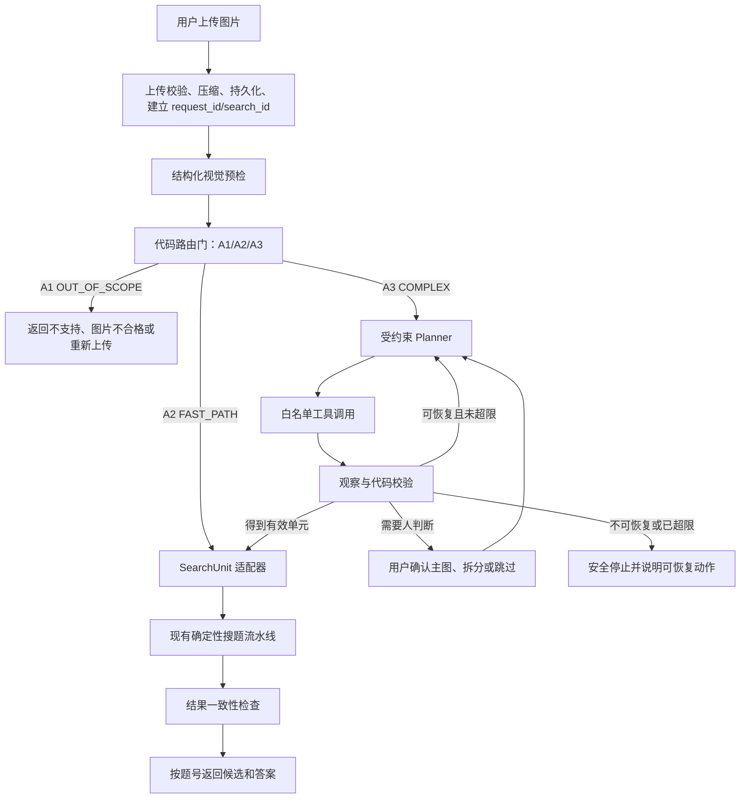

# 8890 C 端复杂题图入口开发规范

## 1. 文档用途

本文是 `8890` 业务验证线的权威开发规范，用于跨对话持续实现，防止后续开发把局部想法误当成最终目标。

新对话继续开发时，依次读取：

1. `AGENTS.md`
2. `.agents/project_memory.md`
3. 本文
4. 本文“现有实现入口”列出的任务相关代码

每完成一个阶段，都应更新本文的阶段状态和 `.agents/project_memory.md`，不能只在对话中说明。本文中的“已确认决策”可以直接执行；“待验证假设”和“开放问题”必须通过样本或用户决定后再固化。

> 当前上下文债务：`.agents/project_memory.md` 和 `.agents/roadmap.md` 受本机 ACL 保护为只读，仍保留“8794 优先”的旧路线。两者与本文在 `8890/8794` 优先级上冲突时，以本文和 `README.md` 为较新事实；不要按旧 roadmap 直接开发 8794。权限恢复后应先用 `project-context-c` 的 bootstrap/handoff 模式压缩并同步这两个文件。

## 2. 目标与问题定义

### 产品目标

让 C 端用户上传不可控图片时，系统仍能可靠地：

- 拒绝明显无关或无法处理的输入；
- 让标准单题快速复用现有搜题线路；
- 把复杂多题、多图和子题图片整理成可检索的标准单元；
- 在拆解失败、结果不确定或用户停止时安全结束；
- 返回前检查题目、主图、荷载、候选和答案的对应关系。

### 目标与当前方案的区别

- 目标是提高 C 端不可控输入下的可靠性，不是“为了使用 Agent 而使用 Agent”。
- 自主 Agent 只解决复杂图片的理解、拆解、校验和恢复，不替代已有确定性检索核心。
- LangGraph 与 DeepSeek Harness 都只是后续 `8794` 学习线的编排候选，不是 `8890` 业务验证的前置条件；尚未决定采用哪一个。

### 当前最大瓶颈

当前固定流水线默认输入接近“一题一主图”。真实 C 端输入可能是白墙、风景、纯文字、多道题、一题多图、公共题干加 a/b/c/d、原结构图和辅助单位力图混合。错误地把这些输入直接送入原线路，会造成误识别、错误检索、长时间等待和任务无法真正停止。

## 3. 已验证事实与待验证假设

### 已验证事实

- `8790` 已有固定图片检索流水线、统一五状态协议、请求/搜题编号、费用记录和反馈闭环。
- `8790/8794` 当前有并行外荷载 A/B 筛查：A 只判 `yes/no`，B 执行原检索；提交栅栏能阻止晚到结果覆盖状态，但已发出的外部模型调用通常不能退费或真正取消。
- 当前多题工具能判断 `single/multi`、列出多题，并使用 OpenCV 候选块和模型筛选尝试裁图；图题绑定不可靠时会退回仅按荷载检索。
- 浏览器上传前会转 JPEG，最长边限制为 2560px，目标约 1MB，必要时降到 2048px；服务端后续裁剪使用的是该压缩图。
- 浏览器“新对话”会中止客户端等待，但服务端 `clear()` 会等待后台图片任务；目前没有独立于会话执行锁的真正停止接口。
- `AgentState` 已承载用户可见对话、题目、章节、候选和答案状态，不适合继续塞入每一个 Planner 内部步骤。
- 代表性复杂案例会把原结构图中的 `q` 与辅助单位力图中的 `Fp=1` 混在一起，说明“看见荷载”不等于“识别实际检索荷载”。
- 仓库中尚无正式 `8890` 启动器、独立 runtime 或 `8890` 专用测试。
- 当前 `scripts/run_tiku_agent_8794.py` 没有接入邀请码门禁、生产额度控制或 8794 看门狗；在这些边界补齐并通过本地健康检查前，不得把公网 Tunnel 直接切到 8794。

### 待验证假设

- C 端标准 A2 单题的占比可能较低，因此 v1 采用 A 先行可能比全量 A/B 并行更省费用；必须用真实路由比例验证。
- 一次结构化视觉调用可能足够完成预检；若模型对图题关系不稳定，才增加第二次局部观察或规则校验。
- 当前压缩分辨率可能足够处理大多数题图；只有实际出现小图裁剪不可读时，才增加高分辨率二次上传。
- 受约束 Planner 能提高 A3 拆解成功率；必须和固定策略、人工确认方案比较，不能以“更自主”本身作为成功指标。

## 4. 线路与隔离边界

| 端口 | 定位 | 本阶段处理 |
| --- | --- | --- |
| `8788` | 现有飞书搜题线 | 不修改、不停止 |
| `8790` | 邀请制 C 端正式线 | 保持稳定，不直接试验新路由 |
| `8793` | 旧评审镜像 | 用户计划退役，但关闭尚未执行 |
| `8794` | 框架/自主 Agent 学习线 | 等 `8890` 契约稳定后，在 LangGraph 与 DeepSeek Harness 间做限时对照 |
| `8795` | 管理员后台 | 继续管理邀请码、额度、费用、反馈和请求记录 |
| `8890` | 非 LangGraph 业务验证线 | 本规范的首要开发目标 |

`8890` 必须具有独立启动入口、端口、Cookie、runtime、session 数据库、日志、checkpoint、临时图片和测试输出。它可以只读使用同一题库 live 数据；不得影响 `8788/8790/8794/8795` 的运行状态。是否接入 `8795` 的正式身份和额度数据，留到有限用户验证前单独决定，原型阶段默认不混用生产会话状态。

若后续把现有 `review-tiku` Tunnel 从 8793 改指向 8794，Cloudflare 界面只需替换 Service URL，但这只切换公网流量，不会停止 8793 看门狗或进程。切换前必须先确认 8794 正在监听且 `/health` 正常，并补齐应用门禁、费用/并发上限和独立看门狗；否则可能直接产生 502 或把无门禁模型入口暴露到公网。若要同时保留两条线，应新建独立子域名，不覆盖现有路由。

## 5. 目标架构



现有确定性搜题流水线继续负责：章节边界、实际荷载规范化、主库/字母库路由、结构类型筛选、粗筛、尺寸过滤、视觉重排、候选选择和答案定位。

## 6. 已确认的架构决策

### 6.1 预检采用“观察开放、决策收敛”

视觉模型负责完整盘点图片内容，不直接自由决定业务动作。它必须输出结构化观察；A1/A2/A3 最终由代码规则决定。

- Prompt 要允许发现未知数量的题目、子题、图和关系。
- 输出必须遵守固定 Schema，无法判断时写 `unknown`，不能猜测。
- Prompt 不求解题目、不搜索题库、不自行承诺裁剪成功。
- 路由不能只依赖模型自报的 `confidence`，还要校验题数、主图数、未绑定图、图片质量和歧义字段。

### 6.2 v1 先 A 后 B，不做全量付费并行

- A 是新图片预检；B 是原确定性搜题线路。
- 只有 A2 或 A3 产出有效 `SearchUnit` 后才启动 B。
- A1 直接返回；A3 先拆解，不允许 B 对整张复杂图抢先提交候选。
- 当前 `8790/8794` 的外荷载 A/B 筛查保持不动，并作为新预检的对照基线，不能在新理解层未达标前直接删除。
- 收集 A1/A2/A3 占比、延迟和费用后，才评估是否仅对高置信 A2 启用推测并行。

### 6.3 A3 使用受约束自主 Agent

Planner 可以根据上一步观察选择下一工具，但不能调用任意代码或改写题库。每一步必须经过权限和参数校验，并受总步骤、同动作重试、耗时和费用上限约束。

### 6.4 拆解结束后回到原线路

Agent 的终点不是答案，而是一个或多个经过校验的 `SearchUnit`。每个单元通过适配器回到原有工具边界，不能另写一套检索、排序或答案查找逻辑。

### 6.5 内部推理不向用户展示

页面只展示可验证的进度和动作，例如“检测到 4 个子题”“正在检查第 2 个题图”“需要你确认主图”。不展示隐藏 Prompt、完整思维链、模型草稿或内部错误。

### 6.6 Planner 状态与对话状态分离

保留 `AgentState` 作为用户可见会话状态；新增 `ImageTaskState` 管理图片预检、规划、裁剪、验证、取消和单元进度。不要为每个 Planner 步骤继续扩展 `AgentState.phase`。

## 7. 预检路由契约

### A1 / `OUT_OF_SCOPE`

仅在证据明确时使用：

- 白墙、风景、人物或明显无关图片；
- 没有结构力学题目；
- 只有无法进入当前题库检索的文字；
- 图片损坏、过度模糊或裁剪残缺到无法继续；
- 没有可识别的主结构和实际外荷载，且不属于需要进一步拆解的歧义情况。

A1 是高风险拒绝动作。只要仍可能包含有效结构力学题目，就不能因为模型“不确定”而判 A1，应转 A3 或要求重新上传。

### A2 / `FAST_PATH`

v1 必须同时满足：

1. 恰好一道独立题目；
2. 恰好一个明确的原结构主图；
3. 没有未绑定图、辅助图或主图角色歧义；
4. 主图边界完整且分辨率足够；
5. 题干、图和实际外荷载关系明确；
6. 能构造一个完整 `SearchUnit`。

A2 不是“看起来像单题”，也不是“只有一个检测框”。以后只有在真实样本证明可靠后，才扩展到多道互相独立、每题一图且绑定明确的输入。

### A3 / `COMPLEX`

除明确 A1 和严格 A2 外，默认进入 A3，包括：

- 一题多图；
- 原结构图、内力图、变形图、单位力图混合；
- 一道大题含 a/b/c/d 子题；
- 公共题干加多个结构图；
- 多道题混在一张图中；
- 有图题和纯文字题混合；
- 图题绑定、主图角色或题目数量不确定；
- 需要裁剪、重排、局部复查或用户确认。

路由原则是：A1 必须非常确定，A2 必须全部满足，其余进入 A3。误入 A3 主要增加时间；复杂图误入 A2 可能返回错误答案。

## 8. 核心数据契约

以下字段是 v1 的设计基线。实现时应使用带版本号的强类型对象和严格解析，不用松散字典在模块间传递。

### `ImageTriage`

```text
schema_version
route_candidate             # 模型观察建议，不直接作为最终路由
question_count
subquestion_count
diagram_count
question_blocks[]
diagrams[]
bindings[]
unbound_regions[]
image_quality
has_ambiguity
unknowns[]
evidence[]
model_confidence
```

### `ProblemSnapshot`

```text
source_image_id
source_width / source_height
questions[]                 # 题号、题干区域、共享题干、子题关系
diagrams[]                  # 位置、角色、质量、可见荷载
bindings[]                  # 题目/子题与图的对应关系
actual_load_evidence[]
chapter_hints[]
structure_hints[]
unknowns[]
```

图的角色至少支持：

```text
original_structure
auxiliary_unit_load
internal_force_diagram
deformation_diagram
dimension_or_annotation
irrelevant
unknown
```

### `SearchUnit`

```text
unit_id
question_label
parent_question_label
stem_text
primary_diagram_path
primary_diagram_bbox
actual_loads[]
chapter_hint
structure_hint
source_bindings[]
quality_flags[]
requires_user_confirmation
```

`actual_loads` 只能来自 `original_structure`。辅助单位力图中的 `Fp=1`、内力图标注和计算过程不能混入实际检索荷载。

### `ImageTaskState`

```text
request_id / search_id / session_id
triage_route
stage
problem_snapshot
search_units[]
current_unit_id
step_count / retry_counts
limits
pending_user_confirmation
cancel_requested
commit_allowed
tool_observations[]          # 结构化、脱敏、可审计
last_public_status
```

## 9. 预检 Prompt 规范

Prompt 的任务是“盘点图片”，不是“自由处理图片”。必须包含以下约束：

- 不得默认一张图只有一道题；
- 枚举所有大题、子题、共享题干和图形区域；
- 判断每个图的角色，并保留 `unknown`；
- 建立题目、子题和图之间的绑定；
- 只把原结构图上作用于结构的荷载列为实际外荷载；
- 明确区分原结构图、单位力图、内力图和变形图；
- 报告图片质量、被截断区域和无法读取的小图；
- 不求解、不检索、不编造不可见文字；
- 只返回满足 Schema 的 JSON。

实现上优先使用一次视觉调用完成结构化观察，再由本地 Schema 校验和路由函数决定 A1/A2/A3。若 JSON 不合法、关键字段互相矛盾或证据不足，不直接降级 A2；重试一次结构化解析，仍失败则进入 A3 的安全恢复或返回可重试错误。

## 10. A3 Planner 与工具边界

### 允许动作

- `inspect_full_image`
- `detect_regions`
- `crop_region`
- `inspect_crop`
- `classify_diagram_role`
- `bind_question_diagram`
- `build_search_unit`
- `validate_search_unit`
- `request_user_confirmation`
- `skip_unit`
- `finish_decomposition`
- `stop_with_recovery`

### 禁止动作

- 任意 shell、文件删除或题库写入；
- 自主跨章节搜索；
- 绕过现有粗筛、尺寸过滤和视觉重排；
- 未经确认把 `unknown` 图当作原结构主图；
- 无限重试、无限扩大裁剪区域或循环调用同一模型；
- 在取消后提交候选、答案或会话状态；
- 向用户输出内部推理或模型原始异常。

### 执行循环

```text
读取 ImageTaskState
→ Planner 输出一个结构化动作和停止条件
→ 权限层校验动作、参数、预算和当前阶段
→ 执行一个白名单工具
→ 记录结构化观察
→ 代码校验进展、质量和循环
→ 完成 SearchUnit / 重新规划 / 请求用户 / 安全停止
```

步骤数、同动作重试数、总耗时和费用必须是配置项。具体默认值在固定样本压测后确定；上线前必须存在硬上限，不能只依赖 Prompt 自律。

## 11. 裁剪与校验

OpenCV 负责确定性区域检测和实际裁剪，模型负责语义角色与关系判断。每次裁剪后至少检查：

- 边界是否在原图内；
- 主结构、支座、荷载和必要标注是否完整；
- 分辨率是否达到后续识别和视觉重排最低要求；
- 是否混入其他题目的主体图；
- 是否与目标题号或子题绑定；
- 是否错误选中单位力图、内力图或局部标注。

裁剪失败时允许有限次数调整边界。无法自动确定时让用户在可见缩略图中选择主图，不继续猜。只有真实样本证明压缩图不够时，才设计“保留/补传高分辨率原图”的第二阶段上传，避免提前增加移动端上传成本。

## 12. 回到现有检索线路

新增 `SearchUnit -> existing pipeline` 适配层。适配层应：

1. 校验主图文件归属当前 session/runtime；
2. 将 `actual_loads`、章节线索、结构线索和主图传入现有工具；
3. 继续调用现有题库路由、结构分类、粗筛、尺寸过滤和视觉重排；
4. 保留现有候选选择、继续搜索和答案定位语义；
5. 保留五状态协议、`request_id/search_id`、费用和反馈绑定；
6. 不因多个单元自动跨章节或合并候选。

多单元 v1 默认按受控顺序处理，避免在单任务并发限制下同时放大模型调用。是否对不同单元并行，必须根据真实完整任务耗时、费用和资源上限再决定。

## 13. 真正的停止、取消与提交栅栏

必须新增：

- 页面可见“停止”按钮；
- 独立取消接口，不能等待当前 session 执行锁；
- 按 `request_id/search_id` 管理的任务注册表；
- `cancel_requested` 取消令牌；
- 每次模型、OpenCV、适配器和候选提交前后的取消检查；
- 最终提交栅栏，取消后禁止晚到结果写回状态；
- 后台任务完成后的资源清理和幂等取消响应。

需要明确：Python `Future.cancel()`、客户端断开或取消令牌不能保证撤回已经发出的外部模型请求，也不能退还其费用。系统能保证的是尽快停止后续步骤，并阻止迟到结果影响用户状态。

## 14. 用户界面与可恢复交互

页面只展示业务进度，不展示思维链：

- 正在检查图片；
- 检测到几道题和几个相关图；
- 正在拆分第几个单元；
- 正在检查主结构图；
- 正在检索第几个单元；
- 等待用户确认；
- 已停止、部分完成或需要重新上传。

至少支持以下用户动作：

- 停止当前任务；
- 确认或改选主图；
- 确认拆分结果；
- 跳过无法处理的单元；
- 重新裁剪或重新上传；
- 对已生成的标准单元继续现有候选操作。

多题结果必须保持题号、主图、候选和答案的稳定对应，允许部分单元成功、部分单元等待确认或失败，不能把部分成功伪装成全部成功。

## 15. 最终结果检查

返回用户前至少校验：

- 预检发现的可处理子题是否都有状态；
- 每个 `SearchUnit` 是否只有一个明确主图；
- 实际荷载是否来自正确原结构图；
- `q + Fp=1` 一类案例是否排除了辅助单位力；
- 章节、题库路由和结构类型是否仍遵守原边界；
- 候选和答案是否绑定正确题号与 `search_id`；
- 取消、旧按钮或旧候选不能提交；
- 部分完成是否有明确说明和恢复动作；
- 用户输出不包含本地路径、内部 Prompt、思维链或英文内部异常。

## 16. 开发阶段与验收门

### Stage 0：正式隔离 `8890` 基线

状态：`DONE`（2026-08-15）

交付：

- `scripts/run_tiku_agent_8890.py`；
- 独立端口、Cookie、runtime、session、日志和临时文件；
- 与 `8790` 固定线路的 mock 行为等价测试；
- 启动和回退说明。

验收：启动 `8890` 不改变其他端口进程或数据；固定标准题在 mock 条件下与现有线路等价。

完成记录：

- 新增 `scripts/run_tiku_agent_8890.py`，默认仅监听 `127.0.0.1:8890`；
- 使用独立 Cookie `tiku_agent_8890_session` 和 runtime `.tmp_tiku_agent_v2_validation_8890/`；
- session 数据库、session 媒体、incoming 临时图片、任务日志、费用台账、反馈数据库和反馈案例均位于 8890 runtime 下；
- 原型默认不接入 `8795` 身份、邀请码或生产额度状态，也不改变任何公网 Tunnel；
- `tests/test_tiku_agent_8890_baseline.py` 覆盖隔离边界、默认回退开关及与 8790 固定 HTTP 线路的 mock 等价，4 项测试通过。

### Stage 1：数据契约与固定评测集

状态：`IN_PROGRESS`

交付：

- `ImageTriage`、`ProblemSnapshot`、`SearchUnit`、`ImageTaskState` 强类型定义；
- Schema 解析、版本和互斥字段校验；
- 脱敏的固定样本清单及人工标签；
- A1/A2/A3 代码路由函数和单元测试。

验收：Schema 非法时不能进入 A2；固定有效题不能误判 A1；固定复杂题不能误放 A2。

当前进度：已建立 `experiments/complex_image_eval/` 固定评测集，包含 8 张已跟踪图片和 5 张题库单题候选；新增 `download.png` 覆盖一题多图、原结构图与单位荷载辅助图。已完成最小 `ImageTriageObservation`、千问观察适配器、分流交接数据包、A1/A2/A3 安全路由函数和纯代码测试；完整 `ProblemSnapshot`、`SearchUnit`、`ImageTaskState` 以及 8890 影子运行尚未接入。千问摘要复跑和 A2/A3 交接冒烟已完成，当前只作为评测结论，不能视为生产验收。

### Stage 2：预检影子运行

状态：`PENDING`

交付：

- 结构化视觉 Prompt；
- 新预检只记录结果，不改变原返回；
- 与当前外荷载筛查、人工标签对照；
- A1/A2/A3 占比、解析失败、延迟和费用报表。

验收：先证明路由稳定，再让它成为权威门。不能只凭一张成功案例提升。

### Stage 3：预检成为 `8890` 权威路由

状态：`PENDING`

交付：

- A1 用户提示和恢复动作；
- A2 直接进入现有线路；
- A3 在 Planner 未完成前明确提示“复杂题图暂不能自动拆解”，不错误进入 B；
- 提交栅栏和协议字段接入。

验收：A1/A2/A3 三条路径可独立回归，A3 不产生错误候选。

### Stage 4：服务端取消闭环

状态：`PENDING`

交付：停止按钮、取消接口、任务注册表、取消令牌、全工具取消检查、迟到提交拦截和清理测试。

验收：在预检、裁剪、模型识别和检索阶段取消后，均不能再写入候选或答案；重复取消安全。

### Stage 5：A3 受约束拆解

状态：`PENDING`

交付：Planner、权限层、白名单工具、裁剪后检查、有限回退、用户确认和 `SearchUnit` 构造。

验收：代表性一题多图、a/b/c/d、多大题混合和 `q + Fp=1` 样本能得到正确单元；超限必定停止。

### Stage 6：多单元检索与最终检查

状态：`PENDING`

交付：适配器、多单元 UI、部分成功、稳定题号绑定、最终一致性检查、费用和反馈接入。

验收：每个单元继续使用原检索核心；单元之间不串题、串候选或串答案；旧按钮失效规则仍成立。

### Stage 7：有限 C 端业务验证

状态：`PENDING`

交付：真实比例、完整耗时 P50/P95、单次成功费用、路由纠正、拆解纠正、停止率和最终成功率报告。

验收：由真实数据决定是否扩大 A2、是否启用选择性并行、是否增加高分辨率上传，以及是否迁移能力到 `8790`。

### Stage 8：`8794` 框架学习线

状态：`PENDING`

前提：`8890` 的数据契约、工具权限、取消语义和验收样本稳定。

候选包括 LangGraph 与 DeepSeek Harness，选择尚未确认。DeepSeek Harness 官方仓库为 MIT 许可证，但当前明确处于 developer preview 并可能发生破坏性兼容变更；它提供类型化工具、权限钩子、取消、后台任务、Session Event 和 Web/headless，但属于 TypeScript/Cordis 技术栈，不能假定能低成本替换现有 Python/FastAPI 产品外壳。

如评估 DeepSeek Harness，只做最多 2 个开发日的隔离 Spike：使用 headless 与最小白名单插件桥接 Python mock，再用 `q + Fp=1` 代表样本验证 `SearchUnit`、取消和状态隔离。默认 shell/文件系统工具不得暴露，不迁移现有 UI、认证、反馈或检索核心，并固定具体版本/commit。只有桥接、延迟、取消、协议和回退均优于自建方案时才提交采用决策；否则继续评估 LangGraph 或现有轻量编排。

## 17. 固定测试矩阵

### 路由样本

- 白墙、风景、人物、无关截图；
- 纯文字且无可检索结构图；
- 一道题、一个清晰主结构图和明确荷载；
- 一道题、一个结构图但模糊或被截断；
- 一题三图：原结构图、内力图、辅助单位力图；
- 原结构 `q` 加辅助图 `Fp=1`；
- 一道大题含 a/b/c/d，每个子题有图；
- 公共题干加多个图；
- 三道大题，其中两道带图、一道纯文字；
- 多个图但题图绑定不确定；
- 手机长截图、旋转图、低对比度图和压缩小图。

### 行为与恢复

- 非法 JSON、字段缺失、互相矛盾和模型超时；
- OpenCV 未找到区域、找到过多区域和越界框；
- 裁剪缺支座、缺荷载、混入相邻题；
- 用户确认主图、改选、跳过和重新上传；
- 在每个阶段停止；
- 外部调用迟到、失败、部分成功和费用 usage 缺失；
- 多单元中一项失败但其他项成功；
- 刷新、旧按钮、重复请求和同会话串行。

### 初始硬门槛

- 固定有效题误判 A1：`0`；
- 固定复杂题误放 A2：`0`；
- Schema 解析失败后进入 A2：`0`；
- 取消后候选或答案提交：`0`；
- 越界工具、题库写工具和跨章节自主搜索调用：`0`；
- A2 mock 检索与现有线路行为差异：`0`。

A3 拆解准确率、端到端成功率、P95 延迟和单次费用阈值，要在样本规模和基线数据形成后确定，不能现在虚构生产指标。

## 18. 观测指标

每次任务至少记录以下脱敏字段：

- triage route、reason code 和 Schema 版本；
- 题目数、图数、未绑定区域数和歧义标志；
- Planner 步骤数、工具序列、重试数和停止原因；
- 自动完成、用户确认、跳过、取消、部分成功或失败；
- 预检、拆解、单元检索和完整任务耗时；
- 模型调用数、Token、估算费用和失败类型；
- `SearchUnit` 数、成功检索数和最终结果数；
- 人工反馈后的真实路由和纠正类型。

不记录隐藏思维链、完整 Prompt、API key、邀请码明文、用户本地路径或无必要的用户原文。

## 19. 时间与难度预估

- 难度：约 `7/10`，中高；核心难点是图题关系、裁剪验证、失败恢复和真实取消，不是 LangGraph 接线。
- 预检路由原型：约 `2-3` 个开发日。
- 可用 MVP：约 `5-8` 个开发日。
- `8890` 业务验证版：约 `8-12` 个开发日。
- 加上真实 C 端样本迭代：约 `2-3` 周。
- 契约稳定后的 `8794` LangGraph 学习版：额外约 `2-4` 个开发日。

这些是当前代码基础上的开发估算，不包含外部模型服务异常、真实样本不足和产品范围继续扩张。

## 20. 非目标与防偏航规则

- 不在第一阶段重写检索核心。
- 不让所有请求都进入 Planner。
- 不用一个“很发散”的 Prompt 同时完成观察、路由、裁剪、检索和最终决策。
- 不把模型自报置信度当作唯一安全依据。
- 不为了降低延迟提前恢复全量 A/B 付费并行。
- 不在没有评测数据时扩大 A2。
- 不先做 LangGraph 再补业务契约。
- 不修改或停止 `8788/8790/8795` 来方便原型开发。
- 不把 `8793` 写成已关闭；实际退役后再更新状态。
- 不把思维链展示给 C 端用户。

每次增加范围前重新问：这是 C 端可靠性的目标，还是当前方案带来的新想法？若不能改善路由正确性、拆解成功率、可恢复性、延迟或费用中的至少一项，应暂缓。

## 21. 开放问题

以下问题不能在实现中悄悄决定：

1. 外层预检 v1 采用千问 `qwen3.7-plus`；是否需要两阶段视觉调用仍待后续数据决定；智谱继续保留给现有 8790 外荷载筛查和视觉复筛，不在本决定中替换；
2. 固定样本集规模和 A3 拆解准确率的业务验收阈值；
3. Planner 最大步骤、单动作重试、总耗时和单任务费用上限；
4. 小图不可读时是否请求高分辨率二次上传；
5. 用户确认采用主图选择、裁剪框调整还是只允许重新上传；
6. `8890` 有限用户验证时是否接入 `8795` 身份与额度控制；
7. 多个 `SearchUnit` 是逐个展示、用户选择后搜索，还是自动顺序完成；
8. `8793` 是关闭、由同一公网 hostname 替换为 8794，还是保留并为 8794 新建子域名；
9. `8794` 最终学习 LangGraph、DeepSeek Harness，还是两者都只做限时对照；当前只完成官方资料核对，用户尚未确认采用 Harness。

## 22. 现有实现入口

- 上传压缩与客户端中止：`tiku_agent/demo_web/demo.js`
- 图片上传和流式接口：`tiku_agent/fastapi_demo.py`
- 当前 A/B 筛查、会话锁和后台图片任务：`tiku_agent/session_runtime.py`
- 当前对话状态：`tiku_agent/state.py`
- 固定图片和检索流程：`tiku_agent/agent.py`
- 多题分析与现有工具边界：`tiku_agent/tools.py`
- OpenCV 多图裁剪辅助：`tiku_shared/multi_question.py`
- 当前外荷载筛查：`tiku_agent/external_load_screen.py`
- 统一请求协议：`tiku_shared/request_protocol.py`
- 隔离线路参考：`scripts/run_tiku_agent_8794.py`
- 现有相关测试：`tests/test_external_load_screen_runtime.py`、`tests/test_tiku_agent_session_runtime.py`、`tests/test_tiku_agent_tools.py`、`tests/test_multi_question_shared.py`

建议新增模块名仅作为实现起点，不是强制结构：

```text
scripts/run_tiku_agent_8890.py
tiku_agent/image_triage.py
tiku_agent/image_contracts.py
tiku_agent/image_task_state.py
tiku_agent/image_planner.py
tiku_agent/image_task_registry.py
tiku_agent/search_unit_adapter.py
tests/test_tiku_agent_8890_baseline.py
tests/test_image_triage.py
tests/test_image_planner.py
tests/test_image_cancellation.py
```

## 23. 下一步唯一入口

Stage 0 已完成。下一步只进入 Stage 1，不同时开发预检模型、Planner、LangGraph 或 DeepSeek Harness：

1. 确认四个强类型对象的最小字段和版本策略；
2. 建立脱敏固定样本清单及人工标签；
3. 实现 Schema 解析、互斥字段校验和 A1/A2/A3 纯代码路由测试；
4. 达到 Stage 1 验收门后，再决定是否进入 Stage 2 预检影子运行。
